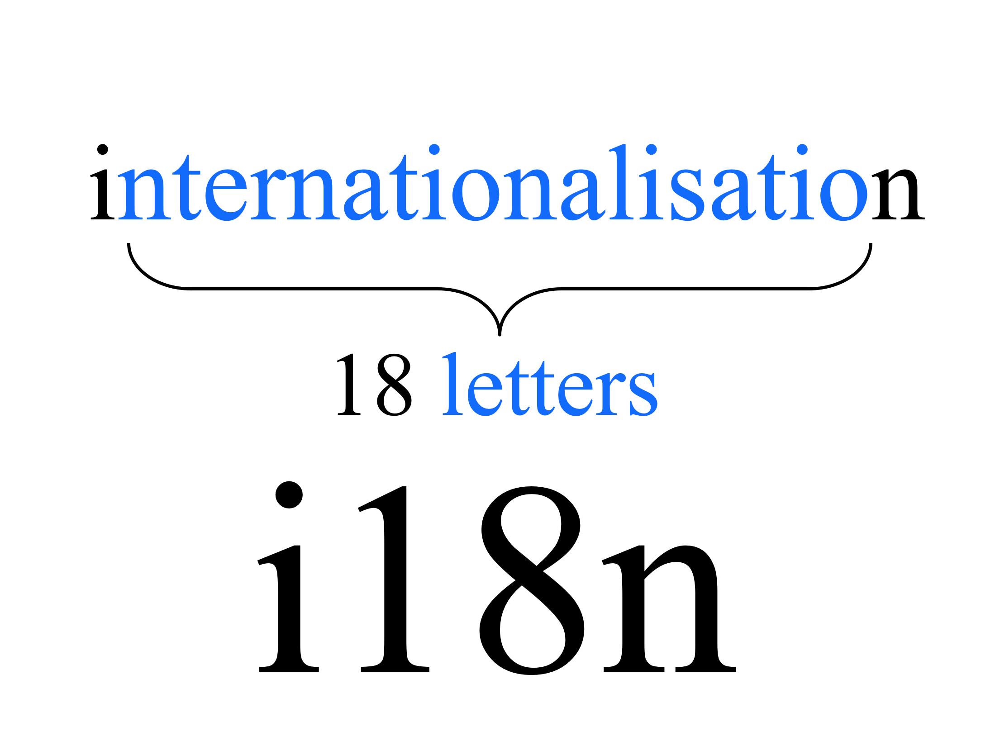

## Internationalization

Nayden Gochev

---

# Agenda
 
 * Internationalization
 * The Locale Class
 * Formatting and Parsing Numbers
 * Character Sets and Conversions
 * Resource Bundles

---

---

## Java i18n
* Use Unicode in strings and GUI
* Provide the ``Locale`` class
    + Encapsulate information about a specific locale (language and country)
* ``ResourceBundle`` class separates locale-specific information in a text file
    + Status messages, Error messages, GUI component labels, etc.

---

## The Locale Class

* A ``Locale`` object represents a specific geographical, political, or cultural region
    + You can use ``Locale`` to adapt information to the user
    + An operation that requires a ``Locale`` to perform its task is called locale-sensitive
    + For example formatting dates and numbers are locale-sensitive operations

---

## Creating a Locale

* Use the constructors in Locale class:
        Locale(String language)
        Locale(String language, 
            String country)

* Examples:

        Locale bgLocale = 
            new Locale("bg");
        Locate caLocate = 
            new Locale("fr", "CA");

* Use the predefined locales:
        Locale deLocale = Locale.GERMANY;

---

## Default Locale

* Obtaining the currently active (default) locale in the JVM:

        Locale currentLocale = Locale.getDefault();

* Examples:
        Locale currentLocale = Locale.getDefault();
        System.out.println(
            currentLocale.getDisplayCountry());

* Change the JVM's default locale:
        Locale.setDefault(Locale.GERMANY);

---

## Using Locales

* Locales are used by other types that are locale-sensitive
* Examples (NumberFormat, DateFormat):

        NumberFormat.getInstance(Locale);
        NumberFormat.getIntegerInstance(Locale);
        NumberFormat.getCurrencyInstance(Locale);
        NumberFormat.getPercentInstance(Locale);

        DateFormat.getDateInstance(Locale);
        DateFormat.getTimeInstance(Locale);
        DateFormat.getDateTimeInstance(Locale);

---

## The NumberFormat class

* The most important methods:

        NumberFormat.
            getInstance(locale);
        NumberFormat.
            getIntegerInstance(locale);
        NumberFormat.
           getCurrencyInstance(locale);
        
        format(long|double);
        parse(String) -> Number;

* Example
        NumberFormat bgFormat = 
            NumberFormat.
            getCurrencyInstance(
            new Locale("bg","BG"));
        System.out.println(
            bgFormat.format(28.50));
        // лв.28,5

---

## Parsing Numbers

* To parse numbers use the NumberFormat.parse(…) method:

* This method may throw a ParseException if the argument passed is not valid!

---

## Example

    NumberFormat usNumberFormat = NumberFormat
            .getNumberInstance(Locale.US);
    String num = "1,292,812.00";
    System.out.println("Original number: " + num);
    try {
        Long parsed = (Long) usNumberFormat.parse(num);
        System.out.println("Parsed number: " + parsed);
    } catch (ParseException pe) {
        pe.printStackTrace();
    }

---

## Character Sets
* Character sets are string encoding schemas (also called encodings)
* UTF-8 and UTF-16 are universal character sets (for all languages)
* Some character sets are specific to some languages and alphabets
                
| Language  | Locale | Default Charset |
|-----------|:------:|----------------:|
| Bulgarian |   bg   |    windows-1251 |
| English   |   en   |      iso-8859-1 |
| German    |   de   |      iso-8859-1 |
| Japanese  | ja     |          euc-jp |

---

## Converting Between String and Sequence of Bytes

* To convert a string to a sequence of bytes in given encoding use:
        String.getBytes(String charsetName)  byte[]
* To construct a string by given sequence of bytes in known encoding use:
        new String(byte[] bytes, String charsetName)
* If encoding is not specified, the default is used:
        java.nio.charset.Charset.defaultCharset().name()

---

## Example

    String str = "Gochev <-> Гочев";
    System.out.printf(str);
    byte[] encoded = str.getBytes("ascii");
    String decoded = new String(encoded, "ascii");
    System.out.printf(decoded);
    // Gochev <-> ??????

* Some letters can not be represented in ASCII encoding and are lost

---

## Resource Bundles

* The ``ResourceBundle`` class
    + Contains locale specific objects such as messages
    + Allows your programs to be be easily localized, or translated, into different languages
    + Make your application language independent

---

## Example 

    String baseName = "MyResources";
    try {
        ResourceBundle rb = ResourceBundle.getBundle(baseName,          
            Locale.FRENCH); // specify French  
        key = "hello";
        greeting = rb.getString(key); // Bonjour
        System.out.println(greeting);
        key = "bye";
        greeting = rb.getString(key); // Au Revoir
        System.out.println(greeting);
    } catch(MissingResourceException e) {
        e.printStackTrace();
    }

---

