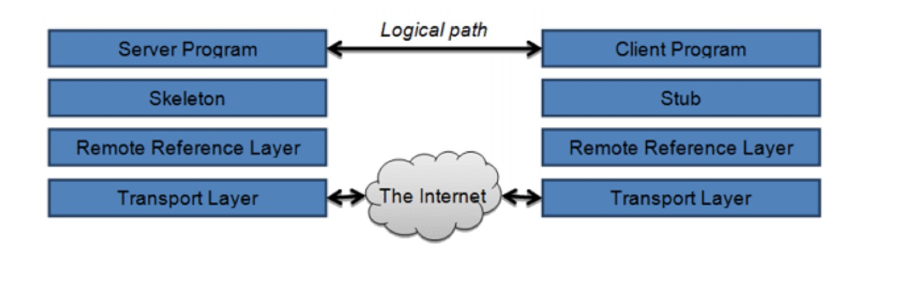
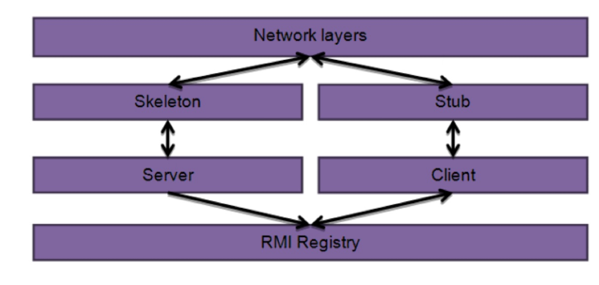

## RMI

Nayden Gochev

---

# RMI
 
 * RMI (Remote Method Invocation) is an architecture to support distributed computing.
 * In RMI architecture, a POJO can be designated as a remote object.

---

## RMI layer model

---

## Architectural overview

---

## The key points of RMI architecture are:

* The server binds the remote reference to the RMI registry with an unique name.
* The client looks up the RMI registry to get the stub of the remote object.
* Remote method calls in Java are similar to local method calls.
* Remote objects from the server can also return a stub to a remote client. As a result, the RMI registry looks up once at the beginning by the client can improve performance considerably.

---

## Implementing an RMI Application

1. Create a remote interface.
2. Implement the remote interface. This class will define methods that will be called remotely.
3. Create a server program. The server class registers the remote class with the RMI registry.
4. Create a client program that will access the server object remotely.

---

## 1. Creating a Remote Interface

        public interface RemoteUtil extends Remote{

        public String getMessage() throws RemoteException;
        public int getFibonacci(int num)
            throws RemoteException;
        }

---

## 2. Implementing a Remote Interface

        public class RemoteUtilImpl
            extends UnicastRemoteObject implements RemoteUtil{
                ....

        

---

## 3. Creating a Server Program
    ...
    main
    ...
    try {
        RemoteUtilImpl impl=new RemoteUtilImpl();
        Naming.rebind("RMIServer", impl);
    }catch(Exception e) {
        System.out.println("Exception: " + e);
    }

---

## 4. Creating a Client Program

    String serverURL="rmi://"+args[0]+"/RMIServer";
    RemoteUtil remoteServer=
    (RemoteUtil)Naming.lookup(serverURL);

    System.out.println(remoteServer.getMessage());
    System.out.println(remoteServer.getFibonacci(5));

---

## Thats all coding !
* however the starting is a bit tricky. 
* we need to:
    + javac *.java
    + rmic RemoteUtilImpl
    + mv *.class ../bin
    + rmiregistry
    + java RMIServer
    + java RMIClient localhost

---

## Things We Have Overlooked

* Security is an issue when working with Java RMI. 
* In a real life application, we need to make sure that the server program runs under a security manager. 
* Development we may need to create AllSecurity.policy file like this one: 
        grant{
            permission java.security.AllPermission
        };
use -Djava.security.policy=AllSecurity.policy 

---

##благодаря ви за вниманието.

* gochev@gmail.com
* http://github.com/gochev
* http://facebook.com/gochev
* http://linkedin.com/in/gochev
* http://gochev.org

