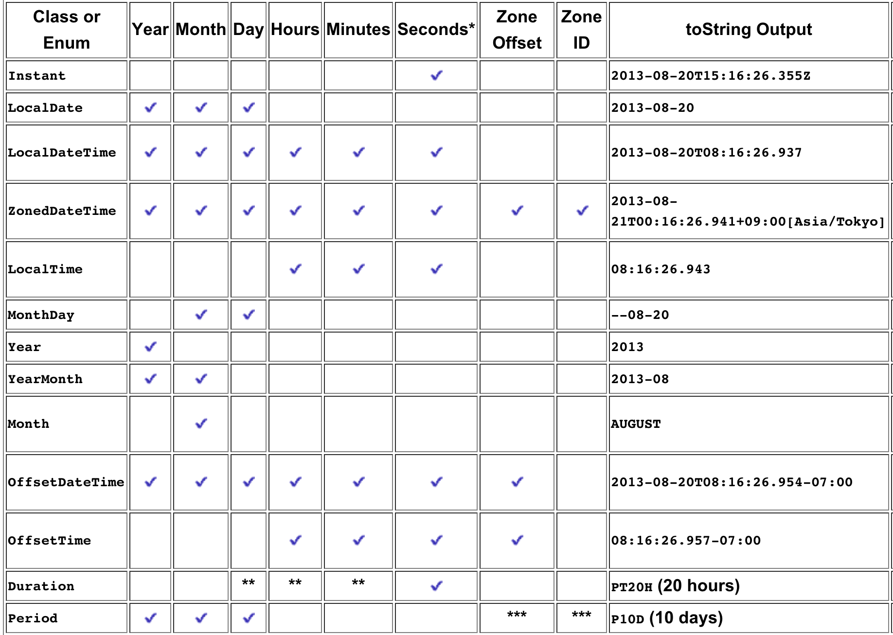

# **Date & Time API**

Nayden Gochev

---

# Agenda

 * Old Api
    + Dates and Calendars
    + Date Formatting and Parsing
 * New Api - Java 8+
    + new Date & Time classes
    + Formatting
 * Old to New API

---

# Dates and Calendars

* The class java.util.Date is used to represent a date and time
* The default constructor sets the date to today (the current date and time)
* The toString() method converts the date to string (in Java specific internal format)

---

# Example

        Date today = new Date();
        System.out.println(today);
        // Thu Mar 09 16:15:27 EET 2015

---

## The Date Class

* The date class dos not support:
    + Extraction of the day, month, year, ...
    + Construction by day, month and year
* All of the above functionality is deprecated because of internationalization problems
* To do that use the Calendar class instead ( will see that later)

---

## Formatting a Date

* The SimpleDateFormat class allows the Date information to be displayed in various formats and strings to be parsed
* The constructor takes a locale or the default locale is used (when not provided)

---

## Example

    Date today = new Date();
    SimpleDateFormat sdf1, sdf2;
    sdf1 = new SimpleDateFormat("MM/dd/yy");
    sdf2 = new SimpleDateFormat("MMMM dd, yyyy");
    sdf1.format(today); // "09/15/15"
    sdf2.format(today); // "September 15, 2015"

---

## SimpleDateFormat – Formatting Characters (1)

| symbol | meaning | type | printing |
|---|---|---|---|
|y	| Year |	Year |	1996; 96 |
|M |	Month in year |	Month |	July; Jul; 07 |
|d |	Day in month  |	Number |	10 |
|E |	Day in week   |	Text  |	Tuesday; Tue |
|a |	Am/pm marker  |	Text  | 	PM |
|H	| Hour in day (0-23) |	Number |	0 |

---

## SimpleDateFormat – Formatting Characters (2)

| symbol | meaning | type | printing |
|---|---|---|---|
|K |	Hour in am/pm (0-11) |	Number 	0 |
|m |	Minute in hour |	Number | 	30 |
|s |	Second in minute |	Number |	55 |
|S |	Millisecond |	Number |	978 |
|Z| 	Time zone |	RFC-822 time zone |-0800 |

---

## Parsing dates

 * To parse dates use the method:

        public Date parse(String text)

 * Note: This method may throw a ParseException if the argument passed is not valid!

 * Note: If we pass as an argument a string with the correct format, but the date is invalid (for example “30.02.2015”) the method will perform the needed calculations and the result will be a new different date (“01.03.2015”). Exception will not be thrown! This can be changed by using setLenient(false).

---

## Example

    String dateString = "03/5/15";
    //note we should always pass the locale to localize the date string.
    //Example output can be 05-九月-2015
    SimpleDateFormat format =
        new SimpleDateFormat("MM/dd/yy", Locale.US);
    try {
        Date date = format.parse(dateString);
        System.out.println("Parsed date: " + date);
    } catch(ParseException pe) {
        System.out.println("Could not parse date!");
    }

---

## The TimeZone Class
* The class TimeZone represents a time zone offset
    + Keeps track of daylight-saving time
* Use TimeZone.getDefault() to get the current time zone
* Creating a TimeZone object:

        TimeZone tz = TimeZone.getTimeZone("EET");

---

## The Calendar Class

 * A Calendar class represents a specific instant in time with millisecond precision
    + Like the Date class, but more accurate to a specific calendar
 * Calendar is an abstract base class for converting between a Date object and a set of integer fields, such as:
    + year, month, day
    + hour, minute, second

---

## The GregorianCalendar Class

* Subclasses of Calendar interpret a Date according to the rules of a specific calendar system
* The Gregorian calendar is the most widespread
* Example
        new GregorianCalendar(TimeZone tz, Locale locale)
* This will constructs a GregorianCalendar by given time zone and locale

---

## The GregorianCalendar class

* To create a NOW Calendar

        GregorianCalendar calendar =
                new GregorianCalendar();
        Date today = new Date();
        calendar.setTime(today);
        int month =
                calendar.get(GregorianCalendar.MONTH);

* Usually you will use Calendar.getInstance()

---

## Dates fun

    SimpleDateFormat dateFormat = new
                SimpleDateFormat("dd.MM.yyyy", new Locale("bg"));
    String firstDateStr = "1.01.2008";
    Date firstDate = dateFormat.parse(firstDateStr);
    String secondDateStr = "1.2.2008";
    Date secondDate = dateFormat.parse(secondDateStr);

    long firstDateMs = firstDate.getTime();
    long secondDateMs = secondDate.getTime();

    long millisecondsPerDay = 24*60*60*1000;
    double days = Math.abs
        ((secondDateMs - firstDateMs) / millisecondsPerDay);
    Date today = new Date();
    long todayMs = today.getTime();

    Date tomorrow = new Date(todayMs+millisecondsPerDay);

    System.out.println(days);
    System.out.println(tomorrow);

---

## The DateFormat class

* Provides static methods for obtaining the default date and time formatters
    + Uses the the default or a given locale
    + Provides a number of formatting styles, including FULL, LONG, MEDIUM, and SHORT
            Locale bgLocale = new Locale("bg");
            DateFormat bgFmt = DateFormat.getDateTimeInstance(
                DateFormat.LONG, DateFormat.LONG, bgLocale);
            Date now = new Date();
            System.out.println(bgFmt.format(now));
            // Петък, 2006, Март 10 18:02:42 EET

---

## The New Date And Time API

* The Date-Time API was developed using several design principles.
    + Clear: The methods in the API are well defined and their behavior is clear and expected. For example, invoking a method with a null parameter value typically triggers a NullPointerException.
    + Fluent. Because most methods do not allow parameters with a null value and do not return a null value, method calls can be chained together and the resulting code can be quickly understood.
    + Immutable

---

## Packages

* The Date-Time API consists of the primary package, java.time and 4 subpackages:
    + java.time
    + java.time.format
    + java.time.zone
    + java.time.temporal
    + java.time.chrono

---

### Many classes

Instant, LocalDate, LocalDateTime, ZonedDateTime, LocalTime, MonthDay, Year, YearMonth, Month, OffsetDateTime, OffsetTime, Duration, Period
* We will look at the most used ones.

---

---

## Method Naming Conventions in Date&Time API

| Prefix |   Method Type  |                                                                   Info |
|--------|:--------------:|-----------------------------------------------------------------------:|
| of     | static factory |                                                    Creates an instance |
| from   | static factory |       Converts the input parameters to an instance
| parse  | static factory |    Parses the input string to produce an instance                       |
| get    | instance       | Returns a part of the state of the target object.                      |

---

## Method Naming Conventions in Date&Time API

| Prefix |   Method Type  |                                                                   Info |
|--------|:--------------:|-----------------------------------------------------------------------:|
| is     | instance       | Queries the state of the target object.                                |
| with   | instance       | Returns a copy of the target object with one element changed;          |
| plus   | instance       | Returns a copy of the target object with an amount of time added.      |
| minus  | instance       | Returns a copy of the target object with an amount of time subtracted. |

---

## Method Naming Conventions in Date&Time API

| Prefix |   Method Type  |                                                                   Info |
|--------|:--------------:|-----------------------------------------------------------------------:|
| to     | instance       | Converts this object to another type.                                  |
| at     | instance       | Combines this object with another.                                     |

---

## Month Example

    Month month = Month.AUGUST;

    Locale locale = Locale.getDefault();

    System.out.println(month.getDisplayName(
                    TextStyle.FULL, locale));
    System.out.println(month.getDisplayName(
                    TextStyle.NARROW, locale));
    System.out.println(month.getDisplayName(
                    TextStyle.SHORT, locale));

    //August
    //A
    //Aug

---

## LocalDate

    LocalDate date = LocalDate.of(2000, Month.NOVEMBER, 20);

    DayOfWeek dotw = LocalDate.of(2012, Month.JULY, 9).getDayOfWeek();

    LocalDate date = LocalDate.of(2000, Month.NOVEMBER, 20);
    TemporalAdjuster adj = TemporalAdjusters.next(DayOfWeek.WEDNESDAY);
    LocalDate nextWed = date.with(adj);
    System.out.printf("For the date of %s,
        the next Wednesday is %s.%n",date, nextWed);

    //For the date of 2000-11-20, the next Wednesday is 2000-11-22.

---

## MonthDay & Year

    MonthDay date = MonthDay.of(Month.FEBRUARY, 29);
    boolean validLeapYear = date.isValidYear(2010);

    boolean validLeapYear = Year.of(2012).isLeap();

---

## LocalTime

    LocalTime thisSec = LocalTime.now();

    someMethod(thisSec.getHour(),
                    thisSec.getMinute(),
                    thisSec.getSecond());

---

## LocalDateTime
    System.out.printf("now: %s%n", LocalDateTime.now());

    System.out.printf("Apr 15, 1994 @ 11:30am: %s%n",
                    LocalDateTime.of(1994, Month.APRIL, 15, 11, 30));
    System.out.printf("now (from Instant): %s%n",
                    LocalDateTime.ofInstant(Instant.now(),
                    ZoneId.systemDefault()));
    System.out.printf("6 months from now: %s%n",
                    LocalDateTime.now().plusMonths(6));
    System.out.printf("6 months ago: %s%n",
                    LocalDateTime.now().minusMonths(6));
    //now: 2013-07-24T17:13:59.985
    //Apr 15, 1994 @ 11:30am: 1994-04-15T11:30
    //now (from Instant): 2013-07-24T17:14:00.479
    //6 months from now: 2014-01-24T17:14:00.480
    //6 months ago: 2013-01-24T17:14:00.481

---

## Time Zone and Offset Classes

* ZoneId specifies a time zone identifier and provides rules for converting between an Instant and a LocalDateTime.
* ZoneOffset specifies a time zone offset from Greenwich/UTC time.

---

## Example

    Set<String> allZones = new TreeSet<String>(
                ZoneId.getAvailableZoneIds());

    LocalDateTime dt = LocalDateTime.now();

    for (String s : allZones) {
        ZoneId zone = ZoneId.of(s);
        ZonedDateTime zdt = dt.atZone(zone);
        ZoneOffset offset = zdt.getOffset();
        System.out.printf(String.format("%35s  %10s%n", zone, offset));
        }
       //...
       // Europe/Chisinau     +03:00
       // Europe/Copenhagen     +02:00
       // Europe/Dublin     +01:00
       // Europe/Gibraltar     +02:00

---

## The Date-Time API provides three temporal-based classes that work with time zones:

* ZonedDateTime handles a date and time with a corresponding time zone with a time zone offset from Greenwich/UTC.
* OffsetDateTime handles a date and time with a corresponding time zone offset from Greenwich/UTC, without a time zone ID.
* OffsetTime handles time with a corresponding time zone offset from Greenwich/UTC, without a time zone ID.

---

## ZonedDateTime

* The ZonedDateTime class, in effect, combines the LocalDateTime class with the ZoneId class. It is used to represent a full date (year, month, day) and time (hour, minute, second, nanosecond) with a time zone (region/city, such as Europe/Paris).

---

## OffsiteDateTime

    // Find the last Thursday in July 2013.
    LocalDateTime date = LocalDateTime.of(2013, Month.JULY, 20, 19, 30);

    ZoneOffset offset = ZoneOffset.of("-08:00");

    OffsetDateTime date = OffsetDateTime.of(date, offset);

    OffsetDateTime lastThursday =
        date.with(TemporalAdjuster.lastInMonth(DayOfWeek.THURSDAY));

    System.out.printf("The last Thursday in July 2013 is the %sth.%n",
                    lastThursday.getDayOfMonth());

    //The last Thursday in July 2013 is the 25th.

---

## Instant
 * One of the core classes of the Date-Time API

        import java.time.Instant;
        Instant timestamp = Instant.now();
        //2013-05-30T23:38:23.085Z
        Instant oneHourLater =
                    Instant.now().plusHours(1);

---

## Instant (2)
 * There are methods for comparing instants, such as isAfter and isBefore. The until method returns how much time exists between two Instant objects. 

        long secondsFromEpoch = Instant.ofEpochSecond(0L).
                        until(Instant.now(), ChronoUnit.SECONDS);

---

## Parsing

    String in = ...;
    LocalDate date =
        LocalDate.parse(in, DateTimeFormatter.BASIC_ISO_DATE);

---

## Parsing (2)

    String input = ...;
    try {
        DateTimeFormatter formatter =
        DateTimeFormatter.ofPattern("MMM d yyyy");
        LocalDate date = LocalDate.parse(input, formatter);
        System.out.printf("%s%n", date);
    }
    catch (DateTimeParseException exc) {
        System.out.printf("%s is not parsable!%n", input);
        throw exc;      // Rethrow the exception.
    }
    // 'date' has been successfully parsed

---

## Formatting

    ZoneId leavingZone = ...;
    ZonedDateTime departure = ...;

    try {
        DateTimeFormatter format =
            DateTimeFormatter.ofPattern("MMM d yyyy  hh:mm a");
        String out = departure.format(format);
        System.out.printf("LEAVING:  %s (%s)%n", out, leavingZone);
    }
    catch (DateTimeException exc) {
        System.out.printf("%s can't be formatted!%n", departure);
        throw exc;
    }

    LEAVING:  Jul 20 2013  07:30 PM (America/Los_Angeles)

---

## Duration

* A Duration is not connected to the timeline, in that it does not track time zones or daylight saving time. Adding a Duration equivalent to 1 day to a ZonedDateTime results in exactly 24 hours being added

        Instant t1, t2;
        ...
        long ns = Duration.between(t1, t2).toNanos();

        Instant start;
        ...
        Duration gap = Duration.ofSeconds(10);
        Instant later = start.plus(gap);

---

## ChronoUnit

    import java.time.Instant;
    import java.time.temporal.Temporal;
    import java.time.temporal.ChronoUnit;

    Instant previous, current, gap;
    ...
    current = Instant.now();
    if (previous != null) {
        gap = ChronoUnit.MILLIS.between(previous,current);
    }

---

## Period

* To define an amount of time with date-based values (years, months, days), use the Period class

        LocalDate today = LocalDate.now();
        LocalDate birthday = LocalDate.of(1960, Month.JANUARY, 1);

        Period p = Period.between(birthday, today);
        long p2 = ChronoUnit.DAYS.between(birthday, today);
        System.out.println("You are " + p.getYears() + " years, "
                        + p.getMonths() +
                        " months, and " + p.getDays() +
                        " days old. (" + p2 + " days total)");
        //You are 53 years, 4 months, and 29 days old.
        //(19508 days total)

---

## Period (2)   calculate how long it is until your next birthday

    LocalDate birthday = LocalDate.of(1983, Month.OCTOBER, 28);

    LocalDate nextBDay = birthday.withYear(today.getYear());

    //If your birthday has occurred this year already,
    // add 1 to the year.
    if (nextBDay.isBefore(today)
        || nextBDay.isEqual(today)) {
        nextBDay = nextBDay.plusYears(1);
    }
    Period p = Period.between(today, nextBDay);
    long p2 = ChronoUnit.DAYS.between(today, nextBDay);
    System.out.println("There are " + p.getMonths()
            + " months, and " + p.getDays()
            + " days until your next birthday. ("
            + p2 + " total)");

---

## Converting to/from a Non-ISO-Based Date


    LocalDateTime date = LocalDateTime.of(2013, Month.JULY, 20, 19, 30);
    JapaneseDate jdate     = JapaneseDate.from(date);
    HijrahDate hdate       = HijrahDate.from(date);
    MinguoDate mdate       = MinguoDate.from(date);
    ThaiBuddhistDate tdate = ThaiBuddhistDate.from(date);

    LocalDate date = LocalDate.from(JapaneseDate.now());

---

## Legacy Date-Time Code

* Calendar.toInstant() converts the Calendar object to an Instant.
* GregorianCalendar.toZonedDateTime() converts a GregorianCalendar instance to a ZonedDateTime.
* GregorianCalendar.from(ZonedDateTime) creates a GregorianCalendar object using the default locale from a ZonedDateTime instance.
* Date.from(Instant) creates a Date object from an Instant.
* Date.toInstant() converts a Date object to an Instant.
* TimeZone.toZoneId() converts a TimeZone object to a ZoneId

---

## Examples

* The following example converts a Calendar instance to a ZonedDateTime instance. Note that a time zone must be supplied to convert from an Instant to a ZonedDateTime:
        Calendar now = Calendar.getInstance();

        ZonedDateTime zdt = ZonedDateTime.ofInstant(
                    now.toInstant(),ZoneId.systemDefault()));

---

## Examples (2)

    Instant inst = date.toInstant();

    Date newDate = Date.from(inst);

* Note : There is no one-to-one mapping correspondence between the two APIs, but the table on the next slide gives you a general idea of which functionality in the java.util date and time classes maps to the java.time APIs.

---

## Mapping

| java.util                                         |                 java.time                |
|---------------------------------------------------|:----------------------------------------:|
| java.util.Date                                    |             java.time.Instant            |
| java.util.GregorianCalendar                       |          java.time.ZonedDateTime         |
| java.util.TimeZone                                | java.time.ZoneId or java.time.ZoneOffset |
| GregorianCalendar, with the date set to 1970-01-01 | java.time.LocalTime                     |

---

##благодаря ви за вниманието.

* gochev@gmail.com
* http://github.com/gochev
* http://facebook.com/gochev
* http://linkedin.com/in/gochev
* http://gochev.org
